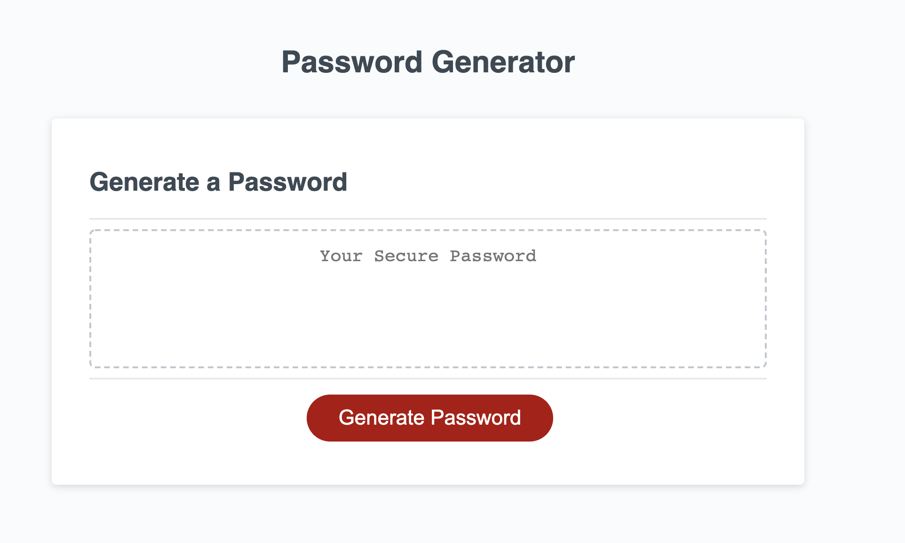

# passwordgenerator

## Description
This file creates a randomly generated password.  The password is generated from the users input of how many characters and what the passwords consists of: lowercase letter, uppercase letters, symbols, and/or numbers.  The password is then displayed on the screen for the user.

## Link to Webpage

## Webpage Image 

## Contributors
Thanks to the instructors and teaching assistants at UNC Chapel Hill Bootcamp for making the creation of this webpage possible.

## Contact
If you have questions feel free to contact me at catherine.ann.milano@gmail.com.
